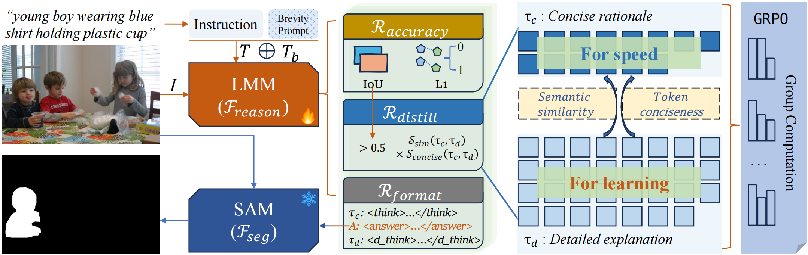
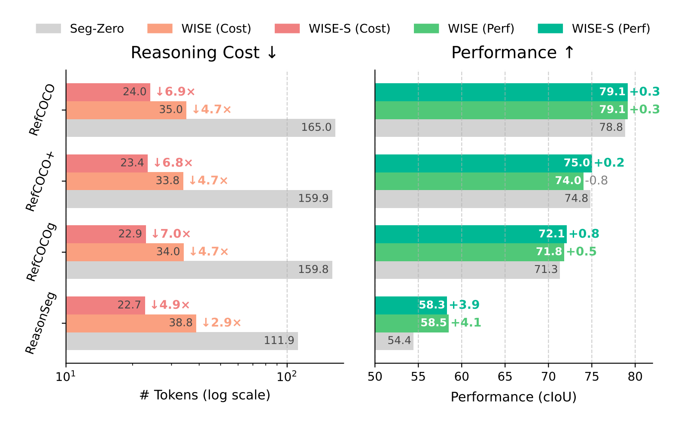
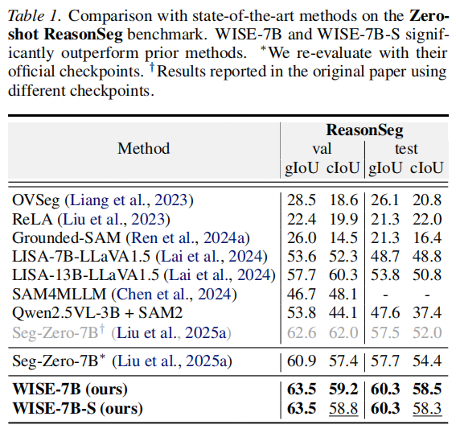
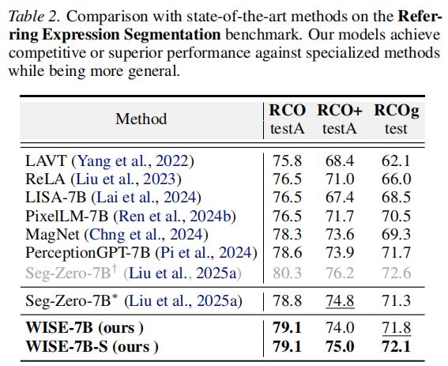

<!-- # Scale Efficient Training for Large Datasets -->
<h2 align="center">Efficient Reasoning via Thought Compression for
Language-Guided Segmentation</h2>
<p align="center"><b>ArXiv 2026</b> | <a href="https://arxiv.org/pdf/2604.02040">[Paper]</a> | <a href="https://github.com/mrazhou/WSIE">[Code]</a> </p>


WISE is a framework for language-guided/referring/reasoning segmentation, which:
* 🚀 **Accelerates** inference by 5x through token reduction.

* 🧠 **Compresses** reasoning via self-distilled concise rationales.

* 🏆 **Achieves** zero-shot SOTA without verbose bottlenecks.


<p align="center">
  
</p>


### Installation
```bash
git clone https://github.com/mrazhou/WSIE.git
cd WSIE

conda create -n wise python=3.11
conda activate wise

pip install torch==2.5.1 torchvision==0.20.1
pip install -e .
pip install sam2 matplotlib
```


### Training


```bash
bash training_scripts/run_qwen2_5_3b_refCOCOg.sh
```

Merge Checkpoint (optional)

```bash
python3 training_scripts/model_merger.py --local_dir [path_to_your_actor_checkpoint]
```

### Evaluation


```bash
bash evaluation_scripts/eval_all.sh [path_to_your_actor_checkpoint]/actor
```

Note: The current code has been organized to some extent. Feel free to open an issue or contact me via email for updates and maintenance.


### Results
<div style="text-align: center;">
    
</div>

<div style="display: flex; justify-content: center; gap: 10px;">
  
  
</div>

### Citation
If you find this repository helpful, please consider citing our paper:
```bibtex
@inproceedings{zhou2026efficient,
  title={Efficient Reasoning via Thought Compression for Language-Guided Segmentation},
  author={Zhou, Qing and Zhang, Shiyu and Jia, Yuyu and Gao, Junyu and Ni, Weiping and Wu, Junzheng and Wang, Qi},
  booktitle={arXiv preprint arXiv:2604.02040},
  year={2026},
}
```
and the Seg-Zero paper:
```bibtex
@article{liu2025segzero,
  title        = {Seg-Zero: Reasoning-Chain Guided  Segmentation via Cognitive Reinforcement},
  author       = {Liu, Yuqi and Peng, Bohao and Zhong, Zhisheng and Yue, Zihao and Lu, Fanbin and Yu, Bei and Jia, Jiaya},
  journal      = {arXiv preprint arXiv:2503.06520},
  year         = {2025}
}
```

### Acknowledgments
Thanks very much to [Seg-Zero](https://github.com/JIA-Lab-research/Seg-Zero), [Qwen2.5-VL](https://huggingface.co/Qwen/Qwen2.5-VL-3B-Instruct) and [SAM2](https://huggingface.co/facebook/sam2-hiera-large) for their great work.
